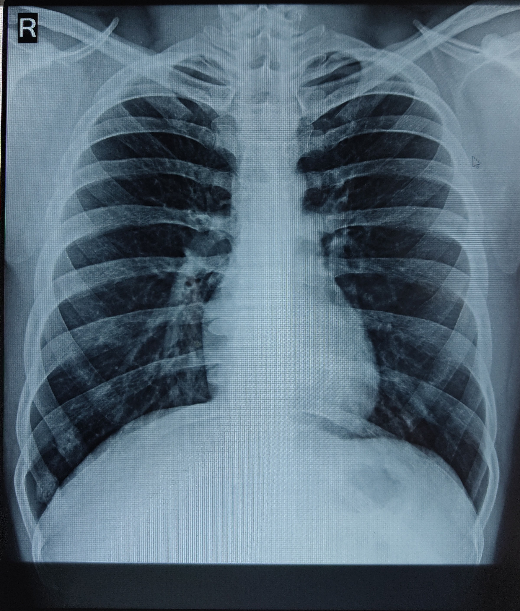

# Chest_X-ray_Classification

 

## Description
This project aims to build and train a deep learning model to classify chest X-ray images as "NORMAL" or "PNEUMONIA". The model is trained using Convolutional Neural Networks (CNNs) on a dataset of chest X-ray images.

The primary goals of this project are:
- To accurately classify chest X-ray images as "NORMAL" or "PNEUMONIA".
- To provide a well-documented codebase that can be used as a starting point for similar image classification tasks.

## Dataset
The dataset used for this project consists of chest X-ray images from two classes: "NORMAL" and "PNEUMONIA". The dataset is divided into three subsets: training, validation, and test sets.

The dataset can be found at [[insert dataset source link here](https://www.kaggle.com/datasets/paultimothymooney/chest-xray-pneumonia)] 

## Installation
1. Clone the repository to your local machine using the following command:
   ```
   git clone https://github.com/iamnimishh/chest-xray-classification.git
   ```

2. Install the required dependencies using pip:
   ```
   pip install tensorflow numpy matplotlib
   ```

## Usage
1. Navigate to the project directory:
   ```
   cd chest-xray-classification
   ```

2. Run the Jupyter Notebook:
   ```
   jupyter notebook
   ```

3. Open the `Chest_X-ray_Classification.ipynb` notebook and follow the instructions provided within.

## Model Training
To train the model on your dataset, follow these steps within the Jupyter Notebook:
- Load and preprocess the chest X-ray images.
- Define the CNN model architecture.
- Compile the model with appropriate loss function and optimizer.
- Train the model using the training and validation sets.

## Model Evaluation
After training, the model will be evaluated on the test set to assess its performance on unseen data. Metrics such as accuracy, precision, recall, and F1-score will be provided.

## Prediction
To use the trained model for prediction, you can load the saved model and make predictions on new chest X-ray images.

## Results
The results of the model evaluation will be presented in the Jupyter Notebook, along with visualizations of the training progress and some example predictions.

## Contributing
Contributions to this project are welcome. If you find any issues or have suggestions for improvement, feel free to open an issue or submit a pull request.

## Contact
For any questions or inquiries, please contact:
- [Nimish Jain](jainnimesh208@gmail.com)
